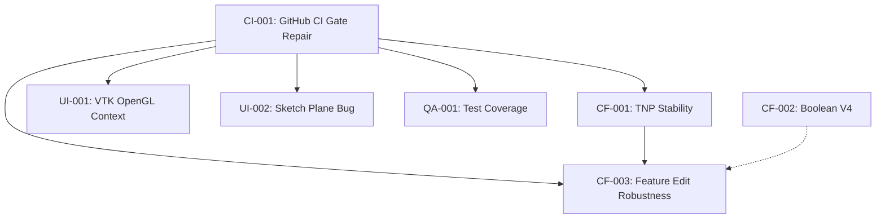

# MashCAD V1 Execution Plan

**Version:** 1.0  
**Last Updated:** 2026-02-19  
**Status:** Active Development

---

## Table of Contents

1. [Overview](#1-overview)
2. [Work Packages](#2-work-packages)
3. [Sprint Plan](#3-sprint-plan)
4. [Risk Register](#4-risk-register)
5. [Dependencies](#5-dependencies)
6. [Milestones](#6-milestones)
7. [Resource Allocation](#7-resource-allocation)
8. [CI/CD Pipeline Status](#8-cicd-pipeline-status)

---

## 1. Overview

### Project Goals
- Deliver MashCAD V1 as a production-ready 3D CAD application
- Ensure all core modeling operations are stable and tested
- Establish CI/CD pipeline with automated quality gates

### Success Criteria
- All P0 work packages completed
- All gates passing in CI (Core-Gate, UI-Gate, Hygiene-Gate)
- Zero critical bugs in release

---

## 2. Work Packages

### Priority Legend
- **P0-BLOCKING**: Must complete before any other work, blocks all downstream tasks
- **P0-CRITICAL**: Must complete for V1 release
- **P1-HIGH**: Important for V1, but not blocking
- **P2-MEDIUM**: Nice-to-have for V1
- **P3-LOW**: Future consideration

---

### P0-BLOCKING: Critical Infrastructure

#### CI-001: GitHub CI Gate Repair
| Field | Value |
|-------|-------|
| **Package ID** | CI-001 |
| **Title** | GitHub CI Gate Repair |
| **Priority** | P0-BLOCKING |
| **Status** | 🔴 NOT STARTED |
| **Owner** | TBD |
| **Est. Effort** | 4-8 hours |

**Description:**
Fix pytest collection/execution in GitHub Actions. The current CI workflow is failing with 0 tests collected, which means no actual test validation is happening.

**Current Error:**
```
Tests: 0 passed, 0 failed, 0 skipped (total: 0)
```

**Root Cause Analysis:**
- pytest cannot find or collect tests in the CI environment
- Possible causes:
  1. Incorrect working directory
  2. Missing test dependencies in conda environment
  3. Path issues with test collection
  4. PowerShell execution issues

**Acceptance Criteria:**
- [ ] All gate scripts pass in GitHub Actions
- [ ] Core-Gate shows >0 tests collected
- [ ] Test count matches local execution
- [ ] Evidence artifacts are generated correctly

**Dependencies:** None (this blocks everything)

**Tasks:**
1. Investigate pytest collection in CI environment
2. Verify conda environment has all dependencies
3. Check working directory and path configuration
4. Add debug output to gate_core.ps1
5. Test fix in feature branch before merge

---

### P0-CRITICAL: Core Functionality

#### CF-001: TNP Stability
| Field | Value |
|-------|-------|
| **Package ID** | CF-001 |
| **Title** | TNP (Topology Naming Protocol) Stability |
| **Priority** | P0-CRITICAL |
| **Status** | 🟡 IN PROGRESS |
| **Owner** | TBD |
| **Est. Effort** | 16 hours |

**Description:**
Ensure Topology Naming Protocol is stable for feature editing and rebuild operations.

**Acceptance Criteria:**
- [ ] All TNP tests passing
- [ ] Feature edit operations maintain topology references
- [ ] No regressions in rebuild operations

**Dependencies:** CI-001 (GitHub CI must be working)

---

#### CF-002: Boolean Operations V4
| Field | Value |
|-------|-------|
| **Package ID** | CF-002 |
| **Title** | Boolean Operations Engine V4 |
| **Priority** | P0-CRITICAL |
| **Status** | ✅ COMPLETED |
| **Owner** | TBD |
| **Est. Effort** | 24 hours |

**Description:**
Robust boolean operations (union, subtract, intersect) using OCP.

**Acceptance Criteria:**
- [x] All boolean tests passing
- [x] Edge cases handled (coplanar faces, tangent edges)
- [x] Performance acceptable for complex geometries

---

#### CF-003: Feature Edit Robustness
| Field | Value |
|-------|-------|
| **Package ID** | CF-003 |
| **Title** | Feature Edit Robustness |
| **Priority** | P0-CRITICAL |
| **Status** | 🟡 IN PROGRESS |
| **Owner** | TBD |
| **Est. Effort** | 12 hours |

**Description:**
Ensure feature editing (modify, delete, reorder) works reliably.

**Acceptance Criteria:**
- [ ] Feature modification triggers correct rebuild
- [ ] Feature deletion maintains model integrity
- [ ] Feature reordering updates dependencies

**Dependencies:** CI-001, CF-001

---

### P1-HIGH: Important Features

#### UI-001: VTK OpenGL Context
| Field | Value |
|-------|-------|
| **Package ID** | UI-001 |
| **Title** | VTK OpenGL Context in CI |
| **Priority** | P1-HIGH |
| **Status** | 🔴 BLOCKED_INFRA |
| **Owner** | TBD |
| **Est. Effort** | 8 hours |

**Description:**
UI tests require OpenGL context which is unavailable in headless CI.

**Status Classification:** BLOCKED_INFRA (infrastructure limitation, not a code defect)

**Workaround:**
- Skip UI-bound tests in CI
- Run UI tests locally before merge
- Consider virtual framebuffer (Xvfb) for Linux CI

**Dependencies:** CI-001

---

#### UI-002: Sketch Plane Bug Fix
| Field | Value |
|-------|-------|
| **Package ID** | UI-002 |
| **Title** | Sketch Plane Y-Dir Bug |
| **Priority** | P1-HIGH |
| **Status** | 🟡 WORKAROUND IN PLACE |
| **Owner** | TBD |
| **Est. Effort** | 4 hours |

**Description:**
`sketch.plane_y_dir` sometimes becomes `(0, 0, 0)`, causing circle/arc extrusion issues.

**Current Workaround:**
```python
if y_dir.X == 0 and y_dir.Y == 0 and y_dir.Z == 0:
    y_dir = z_dir.cross(x_dir)  # Fallback calculation
```

**Root Cause:** TBD - needs investigation

**Dependencies:** CI-001

---

### P2-MEDIUM: Quality Improvements

#### QA-001: Test Coverage Improvement
| Field | Value |
|-------|-------|
| **Package ID** | QA-001 |
| **Title** | Test Coverage to 80% |
| **Priority** | P2-MEDIUM |
| **Status** | 🟡 IN PROGRESS |
| **Owner** | TBD |
| **Est. Effort** | 20 hours |

**Description:**
Increase test coverage to 80% for core modules.

**Dependencies:** CI-001

---

#### QA-002: Documentation Update
| Field | Value |
|-------|-------|
| **Package ID** | QA-002 |
| **Title** | API Documentation |
| **Priority** | P2-MEDIUM |
| **Status** | 🔴 NOT STARTED |
| **Owner** | TBD |
| **Est. Effort** | 16 hours |

**Description:**
Complete API documentation for all public interfaces.

**Dependencies:** None

---

## 3. Sprint Plan

### Sprint 1: CI Foundation (Week 1)
**Goal:** Fix CI pipeline and establish reliable testing infrastructure

| Task | Package | Priority | Status |
|------|---------|----------|--------|
| **CI-001: GitHub CI Gate Repair** | CI-001 | P0-BLOCKING | 🔴 NOT STARTED |
| Verify Core-Gate tests collected | CI-001 | P0-BLOCKING | 🔴 NOT STARTED |
| Debug pytest collection issues | CI-001 | P0-BLOCKING | 🔴 NOT STARTED |
| Fix conda environment setup | CI-001 | P0-BLOCKING | 🔴 NOT STARTED |
| Validate fix in feature branch | CI-001 | P0-BLOCKING | 🔴 NOT STARTED |

**Sprint 1 Exit Criteria:**
- [ ] CI-001 complete
- [ ] Core-Gate shows >0 tests in GitHub Actions
- [ ] All gate scripts executable in CI

---

### Sprint 2: Core Stability (Week 2-3)
**Goal:** Complete all P0-CRITICAL work packages

| Task | Package | Priority | Status |
|------|---------|----------|--------|
| CF-001: TNP Stability | CF-001 | P0-CRITICAL | 🟡 IN PROGRESS |
| CF-003: Feature Edit Robustness | CF-003 | P0-CRITICAL | 🟡 IN PROGRESS |

**Sprint 2 Exit Criteria:**
- [ ] All P0-CRITICAL packages complete
- [ ] Core-Gate 100% passing

---

### Sprint 3: UI & Quality (Week 4)
**Goal:** Address UI issues and improve quality

| Task | Package | Priority | Status |
|------|---------|----------|--------|
| UI-001: VTK OpenGL Context | UI-001 | P1-HIGH | 🔴 BLOCKED_INFRA |
| UI-002: Sketch Plane Bug | UI-002 | P1-HIGH | 🟡 WORKAROUND |
| QA-001: Test Coverage | QA-001 | P2-MEDIUM | 🟡 IN PROGRESS |

---

## 4. Risk Register

| ID | Risk | Probability | Impact | Mitigation |
|----|------|-------------|--------|------------|
| R1 | CI pipeline remains broken | HIGH | CRITICAL | Prioritize CI-001 above all else |
| R2 | TNP regressions in edge cases | MEDIUM | HIGH | Comprehensive test coverage |
| R3 | UI tests untestable in CI | HIGH | MEDIUM | Document as BLOCKED_INFRA, test locally |
| R4 | Release delayed by P0 items | MEDIUM | HIGH | Aggressive prioritization |
| R5 | Dependency version conflicts | LOW | MEDIUM | Pin versions in requirements.txt |

---

## 5. Dependencies



**Critical Path:** CI-001 → CF-001 → CF-003

---

## 6. Milestones

| Milestone | Target Date | Status | Dependencies |
|-----------|-------------|--------|--------------|
| M1: CI Pipeline Green | Week 1 | 🔴 AT RISK | CI-001 |
| M2: Core Features Stable | Week 3 | 🟡 ON TRACK | CF-001, CF-003 |
| M3: V1 Release Candidate | Week 4 | 🟡 ON TRACK | All P0 complete |
| M4: V1 Release | Week 5 | 🟡 ON TRACK | M3 + QA sign-off |

---

## 7. Resource Allocation

| Resource | Allocation | Focus Area |
|----------|------------|------------|
| Developer 1 | 100% | CI-001 (Week 1), then CF-001 |
| Developer 2 | 100% | CF-003, UI-002 |
| QA | 50% | QA-001, test validation |

---

## 8. CI/CD Pipeline Status

### Current Status (2026-02-19)

| Gate | Status | Tests | Notes |
|------|--------|-------|-------|
| **Core-Gate** | 🔴 FAIL | 0 collected | **CRITICAL: pytest not collecting tests** |
| **PI-010-Gate** | 🔴 FAIL | 0 collected | Blocked by Core-Gate |
| **UI-Gate** | 🟡 BLOCKED_INFRA | 8/14 passing | OpenGL context unavailable in CI |
| **Hygiene-Gate** | 🟡 WARNING | N/A | 7 violations (non-blocking) |
| **Evidence Generation** | 🟡 PARTIAL | N/A | Runs but incomplete |

### Required Fixes

#### Critical (Blocking Release)
1. **CI-001: pytest collection failure**
   - Symptom: `Tests: 0 passed, 0 failed, 0 skipped (total: 0)`
   - Location: `.github/workflows/gates.yml` line 40-45
   - Script: `scripts/gate_core.ps1`
   - Action: Debug pytest invocation, verify paths, check conda env

#### High Priority
2. **Conda environment setup**
   - Verify all dependencies installed correctly
   - Check Python version consistency
   - Ensure pytest and plugins are available

3. **Working directory configuration**
   - Confirm script execution from correct directory
   - Verify test paths are resolvable

### Target State

| Gate | Target Status | Target Tests |
|------|---------------|--------------|
| Core-Gate | ✅ PASS | 248+ passed |
| PI-010-Gate | ✅ PASS | 20+ passed |
| UI-Gate | 🟡 BLOCKED_INFRA | 8/14 (documented limitation) |
| Hygiene-Gate | ✅ PASS | 0 violations |
| Evidence | ✅ PASS | Complete artifacts |

### CI Configuration Files

| File | Purpose | Status |
|------|---------|--------|
| `.github/workflows/gates.yml` | Main CI workflow | Needs fix |
| `.github/workflows/build-executables.yml` | Build automation | OK |
| `scripts/gate_core.ps1` | Core test runner | Needs debug |
| `scripts/gate_ui.ps1` | UI test runner | OK (BLOCKED_INFRA) |
| `scripts/hygiene_check.ps1` | Code hygiene | OK |
| `pytest.ini` | Pytest configuration | Verify |

### Debug Steps for CI-001

1. **Add verbose output to gate_core.ps1:**
   ```powershell
   Write-Host "Python version: $(python --version)"
   Write-Host "pytest version: $(pytest --version)"
   Write-Host "Working directory: $(Get-Location)"
   Write-Host "Test files found: $(Get-ChildItem test/*.py -Count)"
   ```

2. **Verify conda environment:**
   ```powershell
   conda run -n cad_env pip list | Select-String pytest
   ```

3. **Test collection dry run:**
   ```powershell
   conda run -n cad_env python -m pytest --collect-only test/
   ```

4. **Check path issues:**
   ```powershell
   conda run -n cad_env python -c "import sys; print(sys.path)"
   ```

---

## Appendix A: Quick Reference

### Gate Commands (Local)
```powershell
# Run Core-Gate locally
.\scripts\gate_core.ps1

# Run UI-Gate locally
.\scripts\gate_ui.ps1

# Run all gates
.\scripts\gate_all.ps1

# Hygiene check
.\scripts\hygiene_check.ps1
```

### CI Status Badges
<!-- Add badges here when CI is working -->
- Core-Gate: 
- UI-Gate: 

---

**Document End**
