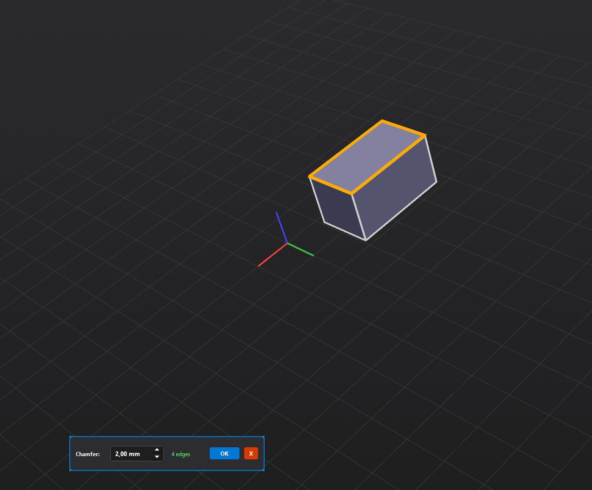
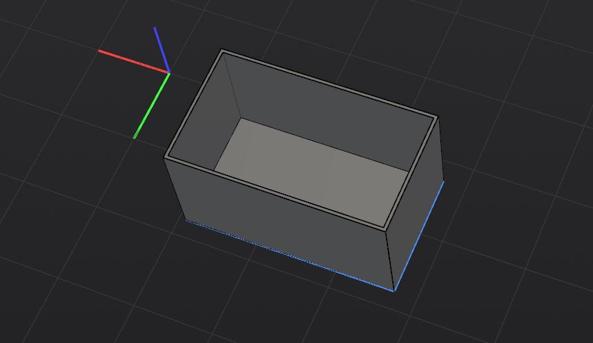

# 3D Operations


Transform your 2D sketches into 3D models using MashCAD's powerful modeling operations. This guide covers all 3D features from basic extrusion to advanced boolean operations.

---

## Table of Contents

1. [Extrude Dialog and Options](#extrude-dialog-and-options)
2. [Fillet and Chamfer](#fillet-and-chamfer)
3. [Boolean Operations](#boolean-operations)
4. [Shell and Sweep](#shell-and-sweep)
5. [Loft Operations](#loft-operations)
6. [Transform Operations](#transform-operations)
7. [Tips & Best Practices](#tips--best-practices)

---

## Extrude Dialog and Options

Extrusion transforms 2D profiles into 3D solids by extending them along a direction.

### Accessing the Extrude Dialog

1. **Select a sketch or profile** in the viewport or browser
2. Click **Extrude** in the 3D Tools panel
3. Or press `E` (with sketch selected)
4. Or right-click → **Extrude**

```
[Screenshot placeholder: Extrude dialog]
```

### Extrude Parameters

| Parameter | Description | Default |
|-----------|-------------|---------|
| **Distance** | Extrusion length in mm | 10.0 |
| **Direction** | Normal (1) or Opposite (-1) | 1 |
| **Operation** | How to combine with existing geometry | New Body |
| **Symmetric** | Extrude both directions | False |
| **Taper Angle** | Draft angle for tapered extrusion | 0° |

### Operation Types

| Operation | Description | Use Case |
|-----------|-------------|----------|
| **New Body** | Creates a separate solid | First feature, independent parts |
| **Join** | Unites with existing body | Adding material |
| **Cut** | Removes from existing body | Holes, pockets, slots |
| **Intersect** | Keeps only overlapping volume | Complex shapes |

### Direction Options

```
[Screenshot placeholder: Direction indicators]
```

- **Normal** - Along sketch plane normal (typically +Z)
- **Opposite** - Against normal (typically -Z)
- **Symmetric** - Half distance each direction
- **Custom Vector** - Specify arbitrary direction

### Preview

The extrude dialog shows a **live preview** in the 3D viewport:
- Yellow wireframe: Original profile
- Green solid: Preview of result
- Blue arrows: Direction indicators

### Workflow Example

```python
# Python console example
from modeling import Body, ExtrudeFeature

# Create a box from sketch
body = Body()
extrude = ExtrudeFeature(
    sketch=my_sketch,
    distance=25.0,
    operation="New Body"
)
body.add_feature(extrude)
```

### Push/Pull

Quick extrusion directly on faces:

1. **Select a face** in the 3D viewport
2. **Drag the face** along its normal
3. Or use **Push/Pull** tool with distance input

**Use cases:**
- Resize a box by dragging top face
- Extend a wall
- Create a pocket by pushing inward

---

## Fillet and Chamfer

Round or bevel edges for better aesthetics and manufacturability.

### Fillet



**Access:** Select edges → **Fillet** tool or `Ctrl+F`

#### Fillet Parameters

| Parameter | Description |
|-----------|-------------|
| **Radius** | Fillet radius in mm |
| **Propagation** | Auto-select tangent edges |

#### Fillet Workflow

1. **Select edges** to fillet (click or box select)
2. Click **Fillet** in toolbar
3. Enter **radius** value
4. Enable **propagation** if desired
5. Click **Apply** or press `Enter`

#### Edge Selection Tips

- **Click** - Select single edge
- **Ctrl+Click** - Add/remove from selection
- **Box select** - Select multiple edges
- **Double-click** - Select tangent chain
- **Right-click** - Selection filter options

#### Fillet Failures

Fillets can fail when:
- Radius is too large for edge length
- Adjacent fillets would overlap
- Complex geometry at corners

**Solutions:**
- Reduce radius
- Use variable radius fillet
- Simplify corner geometry

### Chamfer

**Access:** Select edges → **Chamfer** tool or `Ctrl+Shift+F`

#### Chamfer Parameters

| Parameter | Description |
|-----------|-------------|
| **Distance** | Chamfer width (equal distances) |
| **Angle** | Alternative: distance + angle |
| **Distance1/2** | Unequal chamfer distances |

#### Chamfer Types

| Type | Parameters | Use Case |
|------|------------|----------|
| **Equal Distance** | Single distance | Standard bevel |
| **Distance-Angle** | Distance + angle | Draft angles |
| **Two Distances** | D1, D2 | Asymmetric chamfer |

---

## Boolean Operations

Combine or modify solids using set operations.

### Boolean Types

![Boolean Operations Diagram]

| Operation | Symbol | Description |
|-----------|--------|-------------|
| **Join (Union)** | ∪ | Combines solids into one |
| **Cut (Difference)** | − | Removes tool from target |
| **Intersect** | ∩ | Keeps only overlapping volume |

### Join (Union)

Combines two or more solids into a single body.

**Workflow:**
1. Select **target body**
2. Select **tool body/bodies**
3. Click **Join** or press `J`
4. Result: Single combined solid

**Use cases:**
- Add features to existing part
- Combine imported components
- Merge separate bodies

### Cut (Difference)

Removes tool geometry from target body.

**Workflow:**
1. Select **target body** (to cut from)
2. Select **tool body** (cutter)
3. Click **Cut** or press `C`
4. Result: Target with tool volume removed

**Use cases:**
- Create holes
- Add pockets and slots
- Complex internal features

### Intersect

Keeps only the volume where bodies overlap.

**Workflow:**
1. Select two bodies
2. Click **Intersect**
3. Result: Only shared volume remains

**Use cases:**
- Create complex shapes from primitives
- Trim to common volume
- Find interference areas

### Boolean Best Practices

1. **Check for overlaps** - Small overlaps can cause failures
2. **Use clean geometry** - Self-intersecting shapes cause errors
3. **Order matters** - Cut order affects result
4. **Preview first** - Always check before applying

### Troubleshooting Booleans

| Problem | Cause | Solution |
|---------|-------|----------|
| "No result" | No overlap (intersect) | Check positioning |
| "Invalid result" | Self-intersection | Fix input geometry |
| "Operation failed" | Coplanar faces | Offset slightly |
| Wrong result | Wrong body order | Swap target/tool |

---

## Shell and Sweep

Advanced operations for complex geometries.

### Shell



Creates hollow parts by removing faces and adding wall thickness.

**Access:** Select faces → **Shell** tool

#### Shell Parameters

| Parameter | Description |
|-----------|-------------|
| **Thickness** | Wall thickness in mm |
| **Faces to Remove** | Openings in the shell |
| **Direction** | Inside, Outside, or Center |

#### Shell Workflow

1. **Select faces** to remove (openings)
2. Click **Shell** tool
3. Enter **thickness**
4. Choose **direction**
5. Click **Apply**

#### Shell Direction

| Direction | Description | Use Case |
|-----------|-------------|----------|
| **Inside** | Material inward | Maintain outer dimensions |
| **Outside** | Material outward | Maintain inner dimensions |
| **Center** | Split both ways | Equal inner/outer change |

#### Shell Limitations

- Cannot shell if faces are too complex
- Minimum thickness depends on geometry
- Some fillets/chamfers may need reapplication

### Sweep

Creates solids by moving a profile along a path.

**Access:** Select profile + path → **Sweep** tool

#### Sweep Types

| Type | Description | Use Case |
|------|-------------|----------|
| **Profile Sweep** | 2D profile along path | Pipes, rails |
| **Pipe** | Circular profile along path | Tubes, hoses |
| **Rib** | Profile normal to path | Ribs, webs |

#### Sweep Workflow

1. **Create profile sketch** (cross-section)
2. **Create path sketch** (trajectory)
3. Select **profile** then **path**
4. Click **Sweep**
5. Configure options
6. Click **Apply**

#### Sweep Options

| Option | Description |
|--------|-------------|
| **Twist** | Rotate profile along path |
| **Scale** | Scale profile along path |
| **Keep Normal** | Profile stays normal to path |

---

## Loft Operations

Create smooth transitions between multiple profiles.

### Loft Basics

**Access:** Select multiple profiles → **Loft** tool

```
[Screenshot placeholder: Loft preview]
```

### Loft Workflow

1. **Create profile sketches** on different planes
2. **Select profiles** in order (important!)
3. Click **Loft**
4. Adjust settings if needed
5. Click **Apply**

### Loft Options

| Option | Description |
|--------|-------------|
| **Ruled** | Straight lines between profiles |
| **Smooth** | Curved interpolation |
| **Guide Curves** | Additional curve control |
| **Closed** | Connect last to first profile |

### Profile Selection Order

The order of profile selection affects the loft shape:

```
Profile 1 → Profile 2 → Profile 3 → Result
```

**Tips:**
- Select profiles in logical sequence
- Similar vertex counts work best
- Avoid dramatic shape changes

### Guide Curves

For precise control over loft shape:

1. Create profile sketches
2. Create guide curve sketches
3. Select profiles first
4. Then select guide curves
5. Apply loft

---

## Transform Operations

Move, rotate, and scale 3D geometry.

### Move (Gizmo)

**Shortcut:** `G`

The 3D gizmo provides intuitive positioning:

```
[Screenshot placeholder: Transform gizmo]
```

**Axes:**
- **Red arrow** - X axis
- **Green arrow** - Y axis
- **Blue arrow** - Z axis
- **Planes** - Move on XY, XZ, or YZ plane

### Rotate (Gizmo)

**Shortcut:** `R`

Rotation gizmo shows colored rings for each axis:
- Drag a ring to rotate around that axis
- Center sphere for free rotation
- Enter precise angle in property panel

### Scale (Gizmo)

**Shortcut:** `S`

Scale options:
- **Uniform** - Scale all axes equally
- **Non-uniform** - Scale each axis independently
- **About center** - Scale from centroid
- **About origin** - Scale from world origin

### Transform Panel

For precise numeric input:

1. Select object
2. Open **Transform** panel
3. Enter exact values:
   - Position (X, Y, Z)
   - Rotation (Rx, Ry, Rz)
   - Scale (Sx, Sy, Sz)

### Mirror

Create mirrored copies:

1. Select body
2. Click **Mirror**
3. Select mirror plane (face or plane)
4. Choose: Copy or Move

### Pattern

Create arrays of features:

| Pattern Type | Description |
|--------------|-------------|
| **Linear** | Rows and columns |
| **Circular** | Around an axis |
| **Curve** | Along a path |

**Linear Pattern:**
1. Select feature/body
2. Set direction
3. Set count and spacing
4. Optional: second direction

**Circular Pattern:**
1. Select feature/body
2. Set axis of rotation
3. Set count and angle

---

## Tips & Best Practices

### General Modeling

1. **Start simple** - Build complexity gradually
2. **Name features** - Helps track design intent
3. **Use constraints** - Make designs parametric
4. **Check frequently** - Validate as you go

### Performance

1. **Simplify sketches** - Fewer constraints solve faster
2. **Avoid complex booleans** - Break into simpler operations
3. **Use patterns wisely** - Large arrays impact performance
4. **Hide unused bodies** - Reduces rendering load

### Common Workflows

#### Creating a Bracket

```
1. Sketch profile on XY plane
2. Extrude to thickness
3. Sketch mounting holes
4. Extrude cut through
5. Fillet sharp edges
```

#### Creating a Shell

```
1. Create solid body
2. Select top face
3. Apply Shell with thickness
4. Add fillets to edges
```

#### Creating a Complex Hole

```
1. Sketch circle on face
2. Extrude cut (through all)
3. Chamfer hole edge
4. Pattern if needed
```

### Troubleshooting

| Issue | Solution |
|-------|----------|
| Feature fails | Check sketch is closed |
| Boolean fails | Check for overlaps |
| Fillet fails | Reduce radius |
| Shell fails | Check min thickness |
| Preview slow | Hide other bodies |

### Keyboard Shortcuts

| Key | Action |
|-----|--------|
| `E` | Extrude |
| `F` | Fillet |
| `J` | Join (Boolean Union) |
| `C` | Cut (Boolean Difference) |
| `G` | Move (Grab) |
| `R` | Rotate |
| `S` | Scale |
| `H` | Hide/Show |
| `Delete` | Delete selected |
| `Ctrl+Z` | Undo |
| `Ctrl+Y` | Redo |

---

## Next Steps

Continue your MashCAD journey:

- **[Export & Import](04_export_import.md)** - Work with external files
- **[Keyboard Shortcuts](05_keyboard_shortcuts.md)** - Master all shortcuts
- **[Getting Started](01_getting_started.md)** - Review basics

---

*Last updated: February 2026 | MashCAD v0.3.0*
