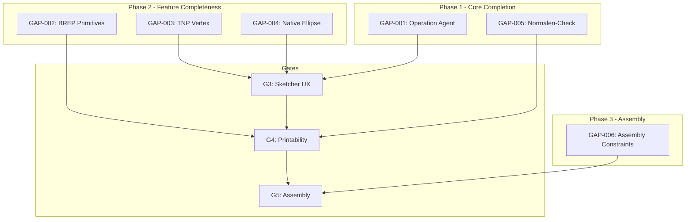
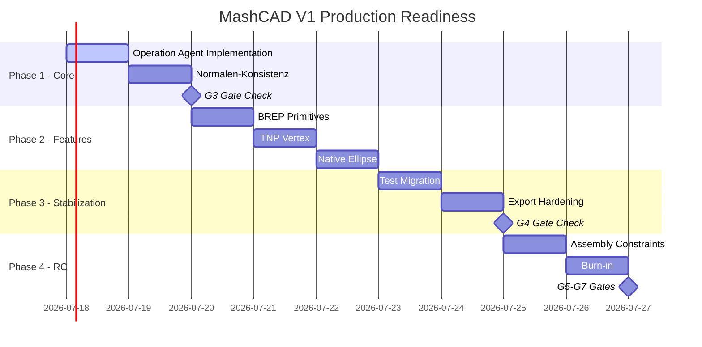

# MashCAD Production Readiness Plan

**Date:** 2026-02-21  
**Branch:** `bugfix/live-preview-optimizations`  
**Status:** Gap-Analyse & Mehrstufiger Produktionsplan

---

## Executive Summary

Diese Analyse identifiziert alle verbleibenden Gaps zwischen dem aktuellen Entwicklungsstand und einer produktionsreifen V1.0-Release. Die Priorisierung folgt dem CAD-Kernel-First-Prinzip und den V1 Non-Negotiables aus der Roadmap-CTP.

### Aktueller Gate-Status

| Gate | Name | Status | Blockierende Gaps |
|------|------|--------|-------------------|
| G0 | Baseline and Scope Lock | ✅ COMPLETE | - |
| G1 | Core Stability Recovery | ✅ COMPLETE | - |
| G2 | Parametric Integrity | ✅ COMPLETE | - |
| G3 | Sketcher and UX Reliability | ⚠️ PARTIAL | UX-Konsistenz, Solver-Edge-Cases |
| G4 | Printability and Export Trust | ⏳ PENDING | Export Preflight, Normalen-Konsistenz |
| G5 | Assembly V1 Readiness | ⏳ PENDING | Constraint-Anwendung |
| G6 | RC Burn-in | ⏳ PENDING | Abhängig von G3-G5 |
| G7 | V1 GA Go/No-Go | ⏳ PENDING | Abhängig von G6 |

---

## 1. Gap-Analyse

### 1.1 BLOCKER - Kritische Implementierungslücken

Diese Gaps müssen vor jeglicher Release-Aktivität geschlossen werden.

#### GAP-001: Operation Agent Stubs ❌

**Datei:** [`sketching/operations/operation_agent.py`](sketching/operations/operation_agent.py:159-241)

**Problem:** 5 von 7 Kernoperationen sind nur Stubs und geben `None` zurück.

| Methode | Zeile | Status |
|---------|-------|--------|
| `chamfer()` | 159-160 | ❌ `return None` |
| `boolean_cut()` | 176-182 | ❌ `return None` |
| `boolean_union()` | 193-195 | ❌ `return None` |
| `shell()` | 217-219 | ❌ `return None` |
| `revolve()` | 239-241 | ❌ `return None` |

**Impact:** Diese Operationen werden vom Sketching-Subsystem verwendet. Obwohl das Haupt-Modeling-System via OCP Helpers funktioniert, führen diese Stubs zu Silent Failures bei alternativen Workflows.

**Priorität:** P0 - Muss für G3 geschlossen werden
**Definition of Done:**
- Alle 5 Methoden implementiert mit echten OCP-Operationen
- Unit-Tests für jeden Pfad (happy path + error handling)
- Integration mit bestehenden Body-Operationen validiert

---

#### GAP-002: BREP Builder Primitive Faces ❌

**Datei:** [`meshconverter/perfect/brep_builder.py`](meshconverter/perfect/brep_builder.py:193-227)

**Problem:** BREP-Rekonstruktion für Primitive gibt `None` zurück statt echte Faces.

| Primitive | Methode | Zeile | Status |
|-----------|---------|-------|--------|
| Cylinder | `_build_cylinder_face()` | 194 | ❌ `return None` |
| Sphere | `_build_sphere_face()` | 208-209 | ❌ `return None` |
| Cone | `_build_cone_face()` | 215-216 | ❌ `return None` |
| Fallback | `_build_fallback_face()` | 226-227 | ❌ `return None` |

**Impact:** Mesh-zu-BREP-Konvertierung schlägt für zylindrische, sphärische und konische Primitiven fehl. Kritisch für STL-Import → Parametric-Workflows.

**Priorität:** P1 - Wichtig für G4 (Export/Import Trust)
**Definition of Done:**
- Face-Extraktion aus BRepPrimAPI Shapes implementiert
- Faces korrekt via Sewing verbunden
- Test-Corpus mit verschiedenen Primitiven validiert

---

### 1.2 MEDIUM - Feature-Completeness Gaps

Diese Gaps beeinträchtigen die Feature-Vollständigkeit, sind aber keine Show-Stopper.

#### GAP-003: TNP Vertex-Support ⚠️

**Datei:** [`modeling/tnp_system.py`](modeling/tnp_system.py:468)

**Problem:** `find_shape_id_by_shape()` unterstützt `TopAbs_VERTEX` nicht vollständig.

```python
elif shape_type == TopAbs_VERTEX:
    # TODO: Vertex-Support wenn benötigt
    if require_exact:
        return self._find_exact_shape_id(ocp_shape, ShapeType.VERTEX)
    return None  # Fallback gibt None!
```

**Impact:** Vertex-basierte Referenzen (z.B. Konstruktionspunkte) können nicht stabil verfolgt werden.

**Priorität:** P2 - Für robuste Vertex-Constraints
**Definition of Done:**
- Vertex-Lookup implementiert
- Hashing-Strategie für Vertex-Positionen definiert
- TNP-Registry speichert Vertex-IDs korrekt

---

#### GAP-004: Native Ellipse-Unterstützung ⚠️

**Datei:** [`modeling/shape_builders.py`](modeling/shape_builders.py:401)

**Problem:** Ellipsen werden als Polylinien approximiert statt native OCP-Ellipsen.

```python
elif geom_type == 'ellipse':
    # TODO: Native Ellipse-Unterstuetzung
    logger.debug(f"    Ellipse: center=...")
```

**Impact:** Ellipsen haben keine echte Kurvenqualität, Tangenten und Constraints sind nicht exakt.

**Priorität:** P2 - Für präzise Sketch-Geometrie
**Definition of Done:**
- `Geom_Ellipse` via OCP erzeugen
- `BRepBuilderAPI_MakeEdge` für Ellipsen-Edges
- Constraint-Solver unterstützt Ellipsen-Tangenten

---

#### GAP-005: Normalen-Konsistenz-Prüfung ⚠️

**Datei:** [`modeling/printability_score.py`](modeling/printability_score.py:503)

**Problem:** Normalen-Konsistenz wird nicht echt geprüft.

```python
# TODO: Echte Normalen-Konsistenz-Prüfung implementieren
# Dies erfordert einen Ray-Casting-Check oder ähnliches
```

**Impact:** Invertierte Normalen werden nicht erkannt → Druck-Artefakte.

**Priorität:** P1 - Kritisch für G4 (Printability)
**Definition of Done:**
- Ray-Casting oder Face-Orientation-Check implementiert
- Warnung bei inkonsistenten Normalen
- Automatische Fix-Option (UnifySameDomain)

---

#### GAP-006: Assembly Constraint-Anwendung ⚠️

**Datei:** [`sketching/core/assembly_agent.py`](sketching/core/assembly_agent.py:204)

**Problem:** `apply_constraints()` gibt Assembly unverändert zurück.

```python
def apply_constraints(self, assembly):
    # TODO: Implementiere Constraint-Anwendung
    return assembly  # Unverändert!
```

**Impact:** Assembly-Constraints (coincident, distance, angle) werden nicht angewendet.

**Priorität:** P2 - Für G5 (Assembly V1)
**Definition of Done:**
- Constraint-Typen (coincident, distance, angle) implementiert
- Solver für kinematische Ketten
- Cycle-Detection und Überbeschränkungs-Diagnose

---

### 1.3 LOW - Nice-to-Have Verbesserungen

#### GAP-007: Torus BREP Face

**Datei:** [`meshconverter/perfect/brep_builder.py`](meshconverter/perfect/brep_builder.py)

**Problem:** Torus-Primitive werden nicht in der Detektor-Liste unterstützt.

**Priorität:** P3 - Post-V1

---

### 1.4 Übersprungene Tests - Kategorisierte Analyse

#### Kategorie A: Feature-Existenz (21 Tests)

Tests in [`test/_archived/test_feature_regression_suite.py`](test/_archived/test_feature_regression_suite.py), die Skip-Marker haben weil Features nicht existieren:

| Feature | Skip-Grund | Tatsächlicher Status |
|---------|------------|---------------------|
| PushPullFeature | "existiert nicht" | ✅ Existiert als OCP BRepFeat |
| BooleanFeature | "existiert nicht" | ✅ Existiert als boolean_engine_v4 |
| DraftFeature | "existiert nicht" | ⚠️ Existiert, aber ohne UI |
| HollowFeature | "existiert nicht" | ⚠️ Existiert als ShellFeature |
| PatternFeature | "existiert nicht" | ✅ Existiert, Tests aktualisieren |
| MirrorFeature | "existiert nicht" | ✅ Existiert, Tests aktualisieren |
| ScaleFeature | "existiert nicht" | ⚠️ Nur via Transform |
| HelixFeature | "existiert nicht" | ✅ Existiert (native OCP helix) |
| Revolve | "requires sketch integration" | ⚠️ Integration fehlt |
| Sweep | "API requires investigation" | ✅ Existiert, aber API-Alignment fehlt |
| Loft | "API requires investigation" | ✅ Existiert, aber API-Alignment fehlt |
| Hole | "API needs investigation" | ⚠️ Partial |

**Aktion:** Diese Tests sind veraltet und referenzieren alte API-Namen. Sie müssen auf die neue OCP-First-API aktualisiert werden.

---

#### Kategorie B: GUI/Import-Probleme (8 Tests)

Tests in [`test/_archived/test_transparency_phase2.py`](test/_archived/test_transparency_phase2.py):

```python
@pytest.mark.skip("GUI-Tests benötigen Aktualisierung - BoxFeature und ViewportPyVista Import fehlen")
```

**Aktion:** Imports auf aktuelle Module aktualisieren:
- `BoxFeature` → `BoxPrimitiveFeature` oder OCP-Primitive
- `ViewportPyVista` Import-Pfade prüfen

---

#### Kategorie C: Headless/CI Environment (8 Tests)

Tests in [`test/_archived/harness/test_interaction_direct_manipulation_w17.py`](test/_archived/harness/test_interaction_direct_manipulation_w17.py):

```python
if _is_headless_environment():
    pytest.skip("W29: GUI tests skipped in headless environment")
```

**Status:** ✅ Korrekt - Headless-Skips sind beabsichtigt für CI ohne Display.

---

#### Kategorie D: Obsolete Phase-Tests (2 Module)

- [`test/test_phase4_revolve_loft_sweep.py`](test/test_phase4_revolve_loft_sweep.py): Vollständig geskippt
- [`test/test_phase5_shell_hollow.py`](test/test_phase5_shell_hollow.py): Vollständig geskippt

```python
pytestmark = pytest.mark.skip(
    reason="OCP-First Migration Phase C-E abgeschlossen: Helper-Klassen entfernt, Tests obsolet"
)
```

**Status:** ✅ Korrekt - Tests sind veraltet durch OCP-Migration. Können archiviert werden.

---

### 1.5 Abhängigkeits-Graph der Gaps



---

## 2. Mehrstufiger Produktionsreife-Plan

### Phase 1: Critical Core (Blocker beseitigen)

**Ziel:** Alle P0/P1 Gaps schließen, G3 bestehen

#### Arbeitspaket 1.1: Operation Agent Implementierung

| Task | Beschreibung | DoD |
|------|--------------|-----|
| 1.1.1 | `chamfer()` via BRepFilletAPI_MakeChamfer | Edge-Chamfer funktioniert, 3 Tests grün |
| 1.1.2 | `boolean_cut()` via BRepAlgoAPI_Cut | Cut-Operation funktioniert, 2 Tests grün |
| 1.1.3 | `boolean_union()` via BRepAlgoAPI_Fuse | Union-Operation funktioniert, 2 Tests grün |
| 1.1.4 | `shell()` via BRepOffsetAPI_MakeThickSolid | Shell mit Opening-Faces, 3 Tests grün |
| 1.1.5 | `revolve()` via BRepPrimAPI_MakeRevol | Revolve um Achse, 2 Tests grün |

**Test-Strategie:**
```python
# Jede Operation bekommt eigenen Test-Block in test/test_operation_agent.py
def test_chamfer_single_edge():
    agent = OperationAgent()
    box = create_test_box(10, 10, 10)
    result = agent.chamfer(box, distance=1.0, edge_indices=[0])
    assert result is not None
    assert result.ShapeType() == TopAbs_SOLID
```

---

#### Arbeitspaket 1.2: Normalen-Konsistenz-Check

| Task | Beschreibung | DoD |
|------|--------------|-----|
| 1.2.1 | Face-Orientation-Analyse implementieren | Alle Faces analysiert |
| 1.2.2 | Inkonsistenz-Detektion | Report bei Mixed-Orientation |
| 1.2.3 | Auto-Fix via ShapeUpgrade_UnifySameDomain | Optional automatische Korrektur |

**Test-Strategie:**
```python
def test_normals_consistency_detects_inverted():
    shape = create_box_with_inverted_face()
    score = analyze_printability(shape)
    assert any(i.category == PrintabilityCategory.NORMALS for i in score.issues)
```

---

### Phase 2: Feature Completeness

**Ziel:** Alle P2 Gaps schließen, Feature-Parity mit Tests

#### Arbeitspaket 2.1: BREP Primitive Builder

| Task | Beschreibung | DoD |
|------|--------------|-----|
| 2.1.1 | Cylinder Face Extraktion | TopExp_Explorer liefert Mantel-Face |
| 2.1.2 | Sphere Face Extraktion | Single Face mit Sphere-Surface |
| 2.1.3 | Cone Face Extraktion | Kegelmantel als Face |
| 2.1.4 | Sewing Integration | Faces zu Solid verbunden |

---

#### Arbeitspaket 2.2: TNP Vertex-Support

| Task | Beschreibung | DoD |
|------|--------------|-----|
| 2.2.1 | Vertex ShapeID Generierung | Unique IDs für Vertices |
| 2.2.2 | Position-basierter Lookup | `find_shape_id_by_vertex()` |
| 2.2.3 | Registry-Integration | Vertices in TNP-Registry |

---

#### Arbeitspaket 2.3: Native Ellipse

| Task | Beschreibung | DoD |
|------|--------------|-----|
| 2.3.1 | Geom_Ellipse Konstruktion | Native OCP-Ellipse |
| 2.3.2 | Edge via BRepBuilderAPI | Ellipse als Wire/Edge |
| 2.3.3 | Constraint-Solver Update | Solver kennt Ellipsen-Tangenten |

---

### Phase 3: Stabilisierung

**Ziel:** Test-Suite bereinigen, G4 bestehen

#### Arbeitspaket 3.1: Test-Migration

| Task | Beschreibung | DoD |
|------|--------------|-----|
| 3.1.1 | Feature-Tests auf OCP-API migrieren | 21 Tests aus archived aktualisiert |
| 3.1.2 | GUI-Test Imports korrigieren | 8 Tests aus transparency_phase2 |
| 3.1.3 | Obsolete Tests archivieren | phase4/phase5 Tests in `_deprecated/` |

---

#### Arbeitspaket 3.2: Export Preflight Härtung

| Task | Beschreibung | DoD |
|------|--------------|-----|
| 3.2.1 | Manifold-Check Aktivierung | Default ON für Export |
| 3.2.2 | Free-Bounds-Warnung | UI-Warnung bei offenen Kanten |
| 3.2.3 | Corpus-Regression | Alle Referenzteile grün |

---

### Phase 4: Release Candidate

**Ziel:** G5-G6 bestehen, Burn-in starten

#### Arbeitspaket 4.1: Assembly Constraints

| Task | Beschreibung | DoD |
|------|--------------|-----|
| 4.1.1 | Coincident-Constraint | Punkte zusammenfallen |
| 4.1.2 | Distance-Constraint | Fixierter Abstand |
| 4.1.3 | Angle-Constraint | Fixierter Winkel |
| 4.1.4 | Constraint-Solver | Kinematische Lösung |

---

#### Arbeitspaket 4.2: Burn-in Execution

| Task | Beschreibung | DoD |
|------|--------------|-----|
| 4.2.1 | 7-Tage Burn-in Periode | Keine neuen P0/P1 |
| 4.2.2 | Trust-Suite Monitoring | Täglich grün |
| 4.2.3 | Known-Limitations Dokument | Veröffentlicht |

---

## 3. Konkrete Aufgabenliste (Priorisiert)

### P0 - Sofort (Blocker für G3)

| # | Task | Datei | DoD |
|---|------|-------|-----|
| 1 | Operation Agent: chamfer() | `sketching/operations/operation_agent.py` | Chamfer erstellt Solid, Unit-Test grün |
| 2 | Operation Agent: boolean_cut() | `sketching/operations/operation_agent.py` | Cut funktioniert, Unit-Test grün |
| 3 | Operation Agent: boolean_union() | `sketching/operations/operation_agent.py` | Union funktioniert, Unit-Test grün |
| 4 | Operation Agent: shell() | `sketching/operations/operation_agent.py` | Shell mit Öffnungen, Unit-Test grün |
| 5 | Operation Agent: revolve() | `sketching/operations/operation_agent.py` | Revolve um Achse, Unit-Test grün |

### P1 - Kurz (Blocker für G4)

| # | Task | Datei | DoD |
|---|------|-------|-----|
| 6 | Normalen-Konsistenz | `modeling/printability_score.py` | Face-Orientation geprüft |
| 7 | BREP Cylinder Face | `meshconverter/perfect/brep_builder.py` | Zylinder-Face extrahiert |
| 8 | BREP Sphere Face | `meshconverter/perfect/brep_builder.py` | Kugel-Face extrahiert |
| 9 | BREP Cone Face | `meshconverter/perfect/brep_builder.py` | Kegel-Face extrahiert |

### P2 - Mittel (Feature Completeness)

| # | Task | Datei | DoD |
|---|------|-------|-----|
| 10 | TNP Vertex-Support | `modeling/tnp_system.py` | Vertex-Lookup funktioniert |
| 11 | Native Ellipse | `modeling/shape_builders.py` | Geom_Ellipse genutzt |
| 12 | Test-Migration: Features | `test/_archived/` | 21 Tests migriert |
| 13 | Test-Migration: GUI | `test/_archived/` | 8 Tests Import-Fix |

### P3 - Lang (Assembly & Post-V1)

| # | Task | Datei | DoD |
|---|------|-------|-----|
| 14 | Assembly Constraints | `sketching/core/assembly_agent.py` | Coincident/Distance/Angle |
| 15 | Torus BREP | `meshconverter/perfect/brep_builder.py` | Torus-Face |

---

## 4. Test-Strategie

### 4.1 Vermeidung von Timeout-Problemen

```powershell
# Schneller Feedback-Loop
scripts/gate_fast_feedback.ps1 -Profile smoke

# Modulares Testing
conda run -n cad_env pytest test/test_operation_agent.py -v --timeout=30

# Subprozess-Isolierung für GUI-Tests
scripts/run_isolated_gui_test.ps1 -Test test_chamfer_preview
```

### 4.2 Gate-Validierung

| Gate | Script | Kriterien |
|------|--------|-----------|
| Pre-Commit | `scripts/gate_fast_feedback.ps1` | < 60s, Smoke-Tests |
| Core-Gate | `scripts/gate_core.ps1` | 284+ passed, 0 failed |
| UI-Gate | `scripts/gate_ui.ps1` | 120+ passed, 0 failed |
| Full-Gate | `scripts/gate_all.ps1` | Alle Gates grün |

### 4.3 Neue Test-Module

```
test/
├── test_operation_agent.py      # NEU: Unit-Tests für GAP-001
├── test_brep_builder_primitives.py  # NEU: Tests für GAP-002
├── test_printability_normals.py     # NEU: Tests für GAP-005
└── test_tnp_vertex_support.py       # NEU: Tests für GAP-003
```

---

## 5. Risiken und Mitigationen

| Risiko | Wahrscheinlichkeit | Impact | Mitigation |
|--------|-------------------|--------|------------|
| OCP API-Inkompatibilität | Medium | Hoch | API-Version pinnen, Compat-Layer |
| GUI-Test Flakiness | Hoch | Medium | Subprozess-Isolierung, Retry-Logic |
| Performance-Regression | Medium | Medium | Baseline-Tests, Budget-Alerts |
| Scope Creep | Hoch | Hoch | Strikte Gate-Kriterien, No-Feature-Freeze |

---

## 6. Timeline-Übersicht (ohne Zeitschätzungen)



---

## 7. Nächste Schritte

1. **Sofort:** Review dieses Plans mit dem Team
2. **Nach Approval:** Phase 1 in Code-Mode starten
3. **Täglich:** `gate_fast_feedback.ps1` nach jedem Commit
4. **Pro Phase:** Gate-Review vor Weiterarbeit

---

## Anhang A: Referenz-Dateien

| Kategorie | Dateien |
|-----------|---------|
| Gate-Definitionen | [`roadmap_ctp/05_release_gates_and_quality_model.md`](roadmap_ctp/05_release_gates_and_quality_model.md) |
| Non-Negotiables | [`roadmap_ctp/02_v1_definition_non_negotiables.md`](roadmap_ctp/02_v1_definition_non_negotiables.md) |
| Feature Flags | [`config/feature_flags.py`](config/feature_flags.py) |
| OCP Helpers | [`modeling/ocp_helpers.py`](modeling/ocp_helpers.py) |

## Anhang B: Veraltete Dateien zum Aufräumen

| Datei | Aktion |
|-------|--------|
| `V1_EXECUTION_PLAN.md` (Root) | Löschen oder nach `_archived/` |
| `test/_archived/test_feature_regression_suite.py` | Tests migrieren, dann löschen |
| `test/_archived/test_integration_regression_suite.py` | Tests migrieren, dann löschen |
| `test/test_phase4_revolve_loft_sweep.py` | Nach `_deprecated/` |
| `test/test_phase5_shell_hollow.py` | Nach `_deprecated/` |
