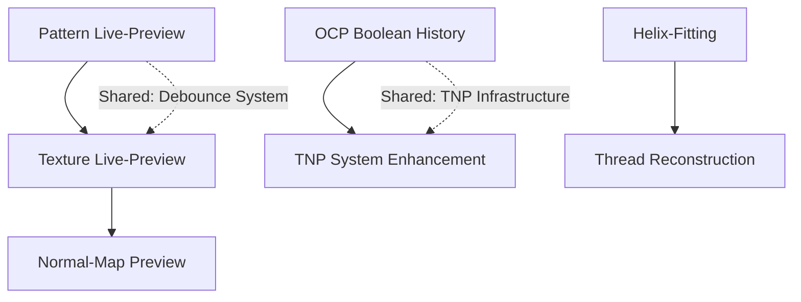

# MashCAD High-Priority TODOs - Architecture Plan

> **Created:** 2026-02-20
> **Status:** Draft for Review
> **Scope:** 5 High-Priority Features from TODO.md

---

## Overview

This document provides a detailed implementation plan for the5 high-priority TODOs identified in [`TODO.md`](../TODO.md). Each feature includes technical approach, affected files, performance considerations, and test strategy.

### Feature Summary

| # | Feature | Priority | Estimated Complexity |
|---|---------|----------|---------------------|
| 1 | Live-Preview für Texturen | Hoch | Mittel |
| 2 | Live-Preview für Patterns | Hoch | Niedrig |
| 3 | Normal-Map Preview im Viewport | Hoch | Hoch |
| 4 | OCP History von Boolean-Operationen | Hoch | Mittel |
| 5 | Helix-Fitting implementieren | Hoch | Mittel |

### Recommended Implementation Order

```
Phase 1: Pattern Live-Preview (easiest, existing infrastructure)
    ↓
Phase 2: Texture Live-Preview (builds on pattern approach)
    ↓
Phase 3: OCP Boolean History (independent, core improvement)
    ↓
Phase 4: Helix-Fitting (independent, specialized)
    ↓
Phase 5: Normal-Map Preview (most complex, requires shader work)
```

---

## Feature 1: Live-Preview für Texturen

### Current State

**Location:** [`gui/main_window.py:9821`](../gui/main_window.py:9821)

```python
def _on_fillet_radius_changed(self, radius):
    """
    Callback wenn der Radius geändert wird.
    Aktuell nur für spätere Preview-Funktionalität reserviert.
    """
    # TODO: Live-Preview wenn Performance es erlaubt
    pass
```

**Existing Infrastructure:**
- [`gui/viewport_pyvista.py:5338`](../gui/viewport_pyvista.py:5338) - `refresh_texture_previews()` already handles texture preview display
- [`gui/viewport_pyvista.py:5709`](../gui/viewport_pyvista.py:5709) - `_apply_texture_preview()` performs mesh displacement
- Texture panel emits `preview_requested` signal (line 37 in texture_panel.py)

### Technical Approach

#### Step 1: Debounced Preview Updates

Add a debounce mechanism to prevent excessive re-computation during slider drag:

```python
# In main_window.py
from PySide6.QtCore import QTimer

class MainWindow:
    def __init__(self):
        # ...existing code...
        self._texture_preview_timer = QTimer()
        self._texture_preview_timer.setSingleShot(True)
        self._texture_preview_timer.timeout.connect(self._execute_texture_preview)
        self._texture_preview_debounce_ms = 150  # 150ms debounce
        self._pending_texture_config = None
```

#### Step 2: Connect Texture Panel Signals

```python
def _on_texture_preview_requested(self, config: dict):
    """
    Debounced texture preview - reuses existing infrastructure.
    """
    self._pending_texture_config = config
    self._texture_preview_timer.start(self._texture_preview_debounce_ms)

def _execute_texture_preview(self):
    """Execute the actual preview after debounce."""
    if not self._pending_texture_config or not self._texture_target_body:
        return
    
    config = self._pending_texture_config
    # Reuse existing texture application logic
    # but with preview flag set
    self.viewport_3d.refresh_texture_previews(self._texture_target_body.id)
```

#### Step 3: Performance Optimization

Use lower subdivision count for live preview, higher for final apply:

```python
# In viewport_pyvista.py _apply_texture_preview()
PREVIEW_SUBDIVISIONS_LIVE = 3   # ~500 vertices - fast
PREVIEW_SUBDIVISIONS_FINAL = 5  # ~2000 vertices - quality

# Add parameter to control quality
def _apply_texture_preview(self, face_mesh, face_data, texture_feature, quality="live"):
    subdivisions = PREVIEW_SUBDIVISIONS_LIVE if quality == "live" else PREVIEW_SUBDIVISIONS_FINAL
    # ... rest of implementation
```

### Affected Files

| File | Changes |
|------|---------|
| [`gui/main_window.py`](../gui/main_window.py) | Add debounce timer, implement `_execute_texture_preview()` |
| [`gui/viewport_pyvista.py`](../gui/viewport_pyvista.py) | Add quality parameter to preview functions |
| [`gui/widgets/texture_panel.py`](../gui/widgets/texture_panel.py) | Ensure all parameter changes emit `preview_requested` |

### Performance Considerations

1. **Debouncing:** 150ms prevents excessive updates during slider drag
2. **LOD System:** Lower subdivision for live preview reduces vertex count by ~4x
3. **Async Option:** Consider `async_tessellation` feature flag for background processing

### Test Strategy

```python
# test/test_texture_preview.py

def test_texture_preview_debounce():
    """Verify preview is debounced during rapid changes."""
    # Send multiple preview requests rapidly
    # Verify only one actual preview execution
    
def test_texture_preview_quality_levels():
    """Verify live vs final quality produces different subdivision counts."""
    
def test_texture_preview_cleanup():
    """Verify preview actors are removed on cancel."""
```

---

## Feature 2: Live-Preview für Patterns

### Current State

**Location:** [`gui/main_window.py:10092`](../gui/main_window.py:10092)

```python
def _on_shell_thickness_changed(self, thickness: float):
    """
    Callback wenn die Wandstärke geändert wird.
    Aktuell nur für spätere Preview-Funktionalität reserviert.
    """
    # TODO: Live-Preview wenn Performance es erlaubt
    pass
```

**Note:** Pattern preview already partially implemented at [`gui/main_window.py:8983`](../gui/main_window.py:8983) - `_update_pattern_preview()`

### Technical Approach

The pattern preview infrastructure already exists! The TODO is about enabling it for more operations like Shell.

#### Step 1: Create Generic Preview Infrastructure

```python
# In main_window.py

def _setup_live_preview_system(self):
    """Initialize debounced preview system for multiple feature types."""
    self._preview_timers = {}
    self._preview_configs = {}
    
    for feature_type in ['fillet', 'chamfer', 'shell', 'pattern', 'texture']:
        timer = QTimer()
        timer.setSingleShot(True)
        timer.timeout.connect(lambda ft=feature_type: self._execute_preview(ft))
        self._preview_timers[feature_type] = timer
        self._preview_configs[feature_type] = None
```

#### Step 2: Implement Shell Preview

```python
def _on_shell_thickness_changed(self, thickness: float):
    """Live preview for shell thickness."""
    if not self._shell_mode or not self._shell_target_body:
        return
    
    self._preview_configs['shell'] = {
        'thickness': thickness,
        'body': self._shell_target_body,
        'opening_faces': self._shell_opening_faces.copy()
    }
    self._preview_timers['shell'].start(150)

def _execute_shell_preview(self):
    """Execute shell preview with cached parameters."""
    config = self._preview_configs['shell']
    if not config:
        return
    
    # Create temporary shell preview using OCP
    # Display as semi-transparent overlay
```

### Affected Files

| File | Changes |
|------|---------|
| [`gui/main_window.py`](../gui/main_window.py) | Add generic preview system, implement shell preview |
| [`gui/dialogs/hollow_dialog.py`](../gui/dialogs/hollow_dialog.py) | Connect parameter changes to preview |

### Performance Considerations

1. **Reuse Meshes:** Cache tessellated mesh, only apply transform for pattern preview
2. **Instance Rendering:** For patterns, use PyVista's ability to render same mesh multiple times

### Test Strategy

```python
def test_pattern_preview_linear():
    """Verify linear pattern preview shows correct number of instances."""
    
def test_pattern_preview_circular():
    """Verify circular pattern preview with angle calculation."""
    
def test_shell_preview_openings():
    """Verify shell preview respects opening face selection."""
```

---

## Feature 3: Normal-Map Preview im Viewport

### Current State

**Location:** [`gui/main_window.py:10342`](../gui/main_window.py:10342)

```python
def _on_texture_preview_requested(self, config: dict):
    """
    Preview für Textur (optional - aktuell nicht implementiert).
    Note: Live-Preview würde Normal-Map-Rendering im Shader erfordern.
    Für MVP: Kein Preview, nur Export-Zeit Anwendung.
    """
    # TODO: Optional - Normal-Map Preview im Viewport
    pass
```

### Technical Approach

This is the most complex feature as it requires shader-based rendering in PyVista/VTK.

#### Option A: Displacement Preview (Easier)

Reuse existing displacement-based preview but apply normal perturbation visually:

```python
def _apply_normal_map_preview(self, face_mesh, face_data, texture_feature):
    """
    Visualize normal-map effect via vertex normal modification.
    Does not modify geometry, only lighting response.
    """
    # 1. Generate normal map texture
    # 2. Compute perturbed normals per vertex
    # 3. Apply to mesh cell_normals
    # 4. PyVista will render with modified lighting
```

#### Option B: VTK Shader Customization (Advanced)

```python
# Add custom shader to PyVista plotter
def _setup_normal_map_shader(self):
    """Configure VTK shader for normal mapping."""
    # This requires vtkShader abstraction
    # PyVista supports this via add_mesh's shader replacement
    
    shader_code = """
    // Fragment shader replacement for normal mapping
    uniform sampler2D normalMap;
    varying vec2 vTexCoord;
    
    void main() {
        vec3 normal = texture2D(normalMap, vTexCoord).rgb;
        normal = normalize(normal * 2.0 - 1.0);
        // Apply lighting with perturbed normal
        gl_FragColor = compute_lighting(normal);
    }
    """
```

### Recommended Approach: Hybrid

1. **Phase 1:** Displacement preview (already implemented for textures)
2. **Phase 2:** Normal-only visualization mode (modify cell normals, not vertices)
3. **Phase 3:** Full shader-based normal mapping (requires VTK shader hooks)

### Affected Files

| File | Changes |
|------|---------|
| [`gui/viewport_pyvista.py`](../gui/viewport_pyvista.py) | Add normal perturbation preview mode |
| [`modeling/surface_texture.py`](../modeling/surface_texture.py) | Add normal map generation method |
| [`gui/widgets/texture_panel.py`](../gui/widgets/texture_panel.py) | Add preview mode toggle |

### Performance Considerations

1. **Normal Map Resolution:** Use 128x128 for preview, 512x512 for export
2. **GPU Acceleration:** Shader approach is GPU-native, very fast
3. **Fallback:** CPU-based normal perturbation for compatibility

### Test Strategy

```python
def test_normal_map_generation():
    """Verify normal map is generated correctly for each texture type."""
    
def test_normal_preview_visual():
    """Visual regression test - compare rendered output."""
    
def test_normal_preview_performance():
    """Benchmark preview generation time < 100ms."""
```

---

## Feature 4: OCP History von Boolean-Operationen

### Current State

**Location:** [`modeling/__init__.py:4611`](../modeling/__init__.py:4611)

The TNP system already uses `BRepTools_History` extensively, but the TODO suggests extracting more detailed history from Boolean operations for better topology tracking.

**Existing Infrastructure:**
- [`modeling/tnp_system.py`](../modeling/tnp_system.py) - Shape naming and tracking
- [`modeling/boolean_engine_v4.py`](../modeling/boolean_engine_v4.py) - Returns `BooleanResult` with history
- [`modeling/__init__.py:1359`](../modeling/__init__.py:1359) - `_register_boolean_history()` already exists

### Technical Approach

#### Step 1: Enhance BooleanResult History Capture

```python
# In boolean_engine_v4.py

class BooleanResult:
    # Add detailed history tracking
    history_details: Dict[str, Any] = field(default_factory=dict)
    
    # Track:
    # - Which faces were merged
    # - Which edges were created/modified
    # - Which vertices were merged
```

#### Step 2: Extract History from BOPAlgo

```python
def _extract_detailed_history(self, bool_op, tool_shape, result_shape):
    """
    Extract comprehensive history from BOPAlgo operation.
    
    Captures:
    - Modified faces/edges/vertices
    - Generated shapes (new edges from intersection)
    - Deleted shapes
    """
    from OCP.BRepTools import BRepTools_History
    from OCP.TopExp import TopExp_Explorer
    from OCP.TopAbs import TopAbs_FACE, TopAbs_EDGE, TopAbs_VERTEX
    
    history = bool_op.History()
    
    details = {
        'modified_faces': {},
        'generated_edges': {},
        'merged_vertices': {}
    }
    
    # For each input face, track what it became
    explorer = TopExp_Explorer(tool_shape, TopAbs_FACE)
    while explorer.More():
        face = explorer.Current()
        modified = history.Modified(face)
        generated = history.Generated(face)
        # Store mappings...
        explorer.Next()
    
    return details
```

#### Step 3: Integrate with TNP System

```python
# In tnp_system.py

def track_boolean_operation_detailed(
    self,
    source_solid,
    tool_solid,
    result_solid,
    boolean_history,
    feature_id: str
):
    """
    Enhanced Boolean tracking with detailed history.
    
    Uses OCP's BRepTools_History to map:
    - Source faces → Result faces
    - Tool faces → Result faces  
    - New intersection edges
    """
    # Process modified shapes
    for parent, children in boolean_history.Modified().items():
        self._record_modification(parent, children, feature_id)
    
    # Process generated shapes
    for parent, children in boolean_history.Generated().items():
        self._record_generation(parent, children, feature_id)
```

### Affected Files

| File | Changes |
|------|---------|
| [`modeling/boolean_engine_v4.py`](../modeling/boolean_engine_v4.py) | Add detailed history extraction |
| [`modeling/tnp_system.py`](../modeling/tnp_system.py) | Add `track_boolean_operation_detailed()` |
| [`modeling/__init__.py`](../modeling/__init__.py) | Call enhanced tracking after Boolean ops |
| [`modeling/result_types.py`](../modeling/result_types.py) | Add `history_details` field to `BooleanResult` |

### Performance Considerations

1. **History Overhead:** Minimal - OCP already maintains history during Boolean
2. **Memory:** Store only shape IDs, not full geometry
3. **Lazy Extraction:** Only extract detailed history when TNP debugging is enabled

### Test Strategy

```python
def test_boolean_history_extraction():
    """Verify all modified/generated shapes are captured."""
    
def test_tnp_boolean_tracking():
    """Verify TNP can resolve shapes after Boolean via history."""
    
def test_boolean_history_complex_cases():
    """Test overlapping booleans, multi-tool operations."""
```

---

## Feature 5: Helix-Fitting implementieren

### Current State

**Location:** [`modeling/brep_face_analyzer.py:685`](../modeling/brep_face_analyzer.py:685)

```python
# 8. Gewinde/Helix (BSplines mit helikalem Verlauf)
helix_features = self._detect_helix_features(processed)
```

Current implementation at [`_detect_helix_features()`](../modeling/brep_face_analyzer.py:692) performs basic detection via edge sampling, but lacks proper fitting.

### Technical Approach

#### Step 1: Implement Helix Parameter Fitting

```python
# In brep_face_analyzer.py

import numpy as np
from scipy.optimize import least_squares

def _fit_helix_parameters(self, points: List[Tuple[float, float, float]]) -> Optional[Dict]:
    """
    Fit helix parameters from sampled points.
    
    Helix equation:
        x = r * cos(t)
        y = r * sin(t)
        z = pitch * t / (2 * pi)
    
    Returns:
        Dict with radius, pitch, axis_direction, axis_origin
    """
    points = np.array(points)
    
    # Initial estimates
    center_xy = np.mean(points[:, :2], axis=0)
    radius_init = np.mean(np.sqrt((points[:, 0] - center_xy[0])**2 + 
                                   (points[:, 1] - center_xy[1])**2))
    z_range = points[:, 2].max() - points[:, 2].min()
    pitch_init = z_range / (2 * np.pi)  # Assume one revolution
    
    def helix_residuals(params):
        """Residual function for least squares fitting."""
        r, pitch, cx, cy = params
        residuals = []
        
        for i, (x, y, z) in enumerate(points):
            # Compute expected angle from z
            t = z / (pitch / (2 * np.pi)) if pitch > 0 else 0
            
            # Expected x, y
            x_expected = cx + r * np.cos(t)
            y_expected = cy + r * np.sin(t)
            
            residuals.extend([x - x_expected, y - y_expected])
        
        return residuals
    
    # Fit using least squares
    result = least_squares(
        helix_residuals,
        x0=[radius_init, pitch_init, center_xy[0], center_xy[1]],
        bounds=([0.1, 0.1, -np.inf, -np.inf], [np.inf, np.inf, np.inf, np.inf])
    )
    
    if result.cost < 0.1 * len(points):  # Good fit threshold
        r, pitch, cx, cy = result.x
        return {
            'radius': float(r),
            'pitch': float(pitch),
            'axis_origin': (float(cx), float(cy), 0.0),
            'axis_direction': (0.0, 0.0, 1.0),
            'fit_quality': float(result.cost)
        }
    
    return None
```

#### Step 2: Integrate with Detection

```python
def _detect_helix_features(self, processed: set) -> List[DetectedFeature]:
    """
    Enhanced helix detection with parameter fitting.
    """
    features = []
    
    for face in self._faces:
        if face.idx in processed:
            continue
        if face.surface_type not in (SurfaceType.BSPLINE, SurfaceType.BEZIER):
            continue
        
        # Sample points from edges
        points = self._sample_face_edges(face, n_samples=50)
        
        # Fit helix parameters
        helix_params = self._fit_helix_parameters(points)
        
        if helix_params and helix_params['fit_quality'] < FIT_THRESHOLD:
            features.append(DetectedFeature(
                feature_type=FeatureType.THREAD,
                face_indices={face.idx},
                confidence=1.0 - helix_params['fit_quality'],
                parameters=helix_params
            ))
    
    return features
```

#### Step 3: Use Native OCP Helix for Reconstruction

```python
# Leverage existing native_ocp_helix feature flag
def create_helix_from_fitted_params(self, params: Dict):
    """
    Create native OCP helix from fitted parameters.
    Uses Geom_CylindricalSurface for exact helix.
    """
    from OCP.Geom import Geom_CylindricalSurface
    from OCP.gp import gp_Ax3, gp_Pnt, gp_Dir, gp_Circ
    from OCP.BRepBuilderAPI import BRepBuilderAPI_MakeEdge
    
    # Create cylindrical surface
    axis = gp_Ax3(
        gp_Pnt(*params['axis_origin']),
        gp_Dir(*params['axis_direction'])
    )
    cylinder = Geom_CylindricalSurface(axis, params['radius'])
    
    # Create helix curve on cylinder
    # ... (use existing helix creation code from modeling/ocp_helpers.py)
```

### Affected Files

| File | Changes |
|------|---------|
| [`modeling/brep_face_analyzer.py`](../modeling/brep_face_analyzer.py) | Add `_fit_helix_parameters()`, enhance detection |
| [`modeling/ocp_helpers.py`](../modeling/ocp_helpers.py) | Add helix creation from fitted parameters |
| [`config/feature_flags.py`](../config/feature_flags.py) | Add `helix_fitting_enabled` flag |

### Performance Considerations

1. **scipy Dependency:** Add scipy to requirements for least squares fitting
2. **Sample Count:** 50 points provides good accuracy/performance balance
3. **Early Rejection:** Check radius variance before attempting fit

### Test Strategy

```python
def test_helix_parameter_fitting():
    """Verify fitting recovers known helix parameters."""
    # Generate synthetic helix points
    # Fit parameters
    # Assert recovered params match within tolerance
    
def test_helix_detection_thread():
    """Verify thread/helix faces are detected in test models."""
    
def test_helix_reconstruction():
    """Verify reconstructed helix matches original geometry."""
```

---

## Implementation Timeline

### Phase 1: Pattern & Texture Preview (Lower Risk)

```
Week 1: Pattern Live-Preview Enhancement
- Add generic debounce system
- Enable shell preview
- Test pattern preview modes

Week 2: Texture Live-Preview
- Connect texture panel to preview system
- Add LOD quality switching
- Performance testing
```

### Phase 2: Core Improvements (Independent)

```
Week 3: OCP Boolean History
- Enhance BooleanResult with detailed history
- Integrate with TNP system
- Test complex Boolean operations

Week 4: Helix-Fitting
- Implement least squares fitting
- Integrate with detection pipeline
- Test with thread models
```

### Phase 3: Advanced Rendering (Higher Risk)

```
Week 5-6: Normal-Map Preview
- Phase 1: Normal perturbation preview
- Phase 2: Shader-based approach (optional)
- Visual regression testing
```

---

## Feature Flags

Add these feature flags to [`config/feature_flags.py`](../config/feature_flags.py):

```python
# Live Preview System
"live_preview_textures": False,    # Phase 1: Texture live preview
"live_preview_patterns": False,    # Phase 1: Pattern live preview
"live_preview_shell": False,       # Phase 2: Shell live preview

# Normal Map Preview
"normal_map_preview": False,       # Phase 3: Normal map visualization
"normal_map_shader": False,        # Phase 3: Shader-based (advanced)

# TNP Enhancements
"detailed_boolean_history": False, # Phase 2: Enhanced Boolean history

# Helix Fitting
"helix_fitting_enabled": False,    # Phase 2: Helix parameter fitting
```

---

## Dependencies Between Features



---

## Testing Strategy

### Unit Tests

Each feature should have dedicated unit tests in `test/` directory:
- `test_live_preview.py` - Preview system tests
- `test_normal_map_preview.py` - Normal map visualization tests
- `test_boolean_history.py` - History extraction tests
- `test_helix_fitting.py` - Parameter fitting tests

### Integration Tests

- Test preview with actual user interactions
- Test TNP after Boolean with history
- Test mesh converter with helix detection

### Performance Benchmarks

```python
# benchmarks/preview_performance.py

def benchmark_texture_preview():
    """Target: < 100ms for live preview update."""
    
def benchmark_pattern_preview():
    """Target: < 50ms for pattern preview with 10 instances."""
    
def benchmark_helix_fitting():
    """Target: < 10ms for fitting 50 points."""
```

---

## Risks and Mitigations

| Risk | Impact | Mitigation |
|------|--------|------------|
| Preview performance on complex models | High | LOD system, debouncing, async processing |
| Normal map shader compatibility | Medium | Fallback to CPU-based preview |
| scipy dependency for helix fitting | Low | Bundle scipy or implement simple least squares |
| TNP regression from history changes | High | Comprehensive test coverage, feature flag |

---

## Next Steps

1. **Review this plan** with the team
2. **Create feature branches** for each feature
3. **Implement Phase 1** (Pattern/Texture Preview) first
4. **Enable feature flags** after validation
5. **Update TODO.md** as features are completed
